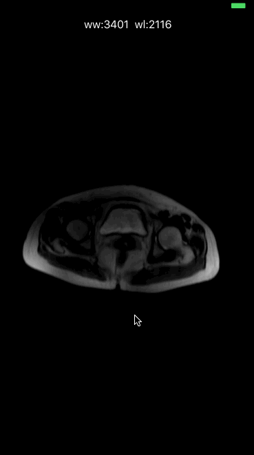

# GDP

support MR,CT,PET-CT

In order to fit more dicom files, we first adapted the dicom file in the cloud, then converted to a more readable json file, and removed the redundant fields in the dicom.

Now only dicom show, the future will add more features, such as multi-window, positioning line, roi, mpr, etc.

Open source is to better enhance the efficiency of doctors, to delay human life and work!

## Author

This project is maintained by the HH-MEDIC company, a team of experienced software engineers from the china. TRUST FIRST !   Just [contact us](mailto:mk@hh-medic.com).

## License

GDP is available under the MIT license. See the LICENSE file for more info.
